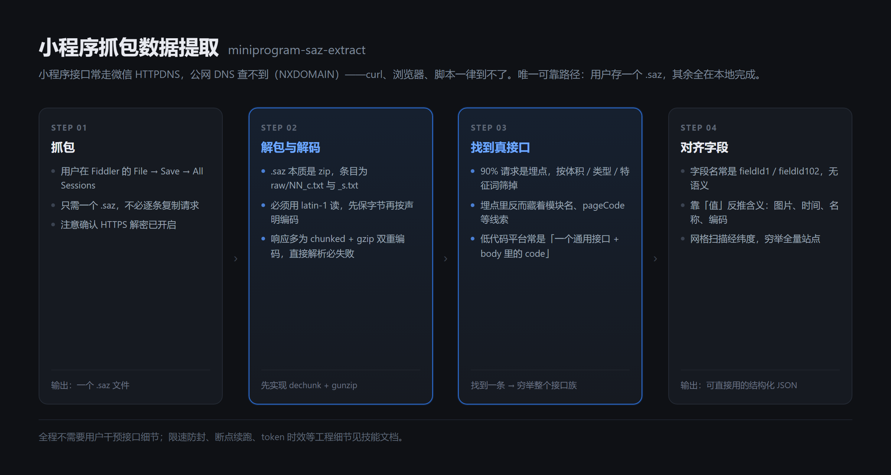
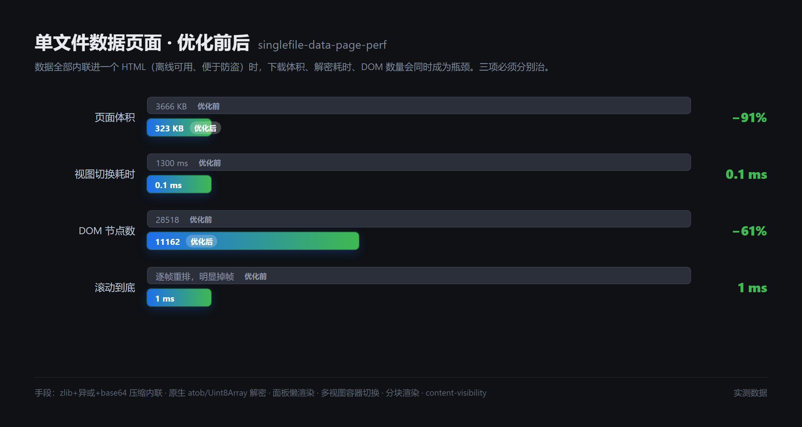

# Agent Skills

> 三个从真实交付里长出来的技能：把微信小程序抓包变成结构化数据、把 3.6MB 的页面压到 323KB、
> 把一台刷成砖的路由器捞回来再榨干它的无线性能。

这些技能不是从文档里抄的，是真实项目里一次次踩出来的——先把一个抓不到数据的小程序啃下来，
再把抓到的数据做成一个又大又卡的页面，然后把它从「卡到没法用」救回「跟手」；
后来又给一台小米 AX3000T 刷 OpenWrt，中间真砖了一次，靠 TFTP 救回来，换了方式重刷成功，
最后把无线吞吐顶到超过它的千兆有线口。

每个结论都对应一次实测，数字都来自真实测量，不是估计。**过程中踩过的坑比结论更值钱**，
所以文档里保留了大量「为什么不能这么做」。

## 目录

| 技能 | 解决什么问题 | 关键数字 |
|---|---|---|
| [`miniprogram-saz-extract`](skills/miniprogram-saz-extract/) | 小程序的数据接口公网抓不到，或抓到了但解不开 | 1600+ 采样点 → 170+ 站点；418 家店铺 → 1448 个商品 |
| [`singlefile-data-page-perf`](skills/singlefile-data-page-perf/) | 数据全内联的单文件页面又大又卡 | 3666KB → **323KB**；切换 1300ms → **0.1ms** |
| [`xiaomi-router-openwrt-flash`](skills/xiaomi-router-openwrt-flash/) | 小米路由器刷 OpenWrt 提升性能，刷完还差最后一段没榨出来 | 4 流上行 675 → **1270 Mbps**；单流下行 628 → **822 Mbps** |

---

## 一、`miniprogram-saz-extract` — 从抓包文件里把数据捞出来



### 卡在哪

微信小程序的数据**经常没法从公网直接抓**。很多接口域名走微信 HTTPDNS，
用公共 DNS 查是 `NXDOMAIN`——这个域名在公网压根不存在，只有小程序运行环境能解析。

于是常规套路全部失效：curl 不到、浏览器打不开、Python 请求被拒。
你甚至能在 H5 站的 JS 里看到这个域名写死在代码里，但就是连不上。

### 常规做法为什么不行

- **猜接口名**：低代码平台（`webify` / `designer` / `lowcode` 这类）的组件接口是后台配置的，
  猜 `list` / `getList` / `query` 全部返回 404，盲猜是死路。
- **只解 zip**：`.saz` 确实是个 zip，但响应体常是 **chunked + gzip 双重编码**，
  直接 `json.loads` 必然失败，很多人卡在这一步就放弃了。
- **把埋点当数据**：抓包里 90% 的请求是埋点，真正的数据接口只占几条。不学会区分就是大海捞针。

### 这个技能给什么

一套完整流程，从「用户存一个 `.saz`」到「拿到结构化的 JSON」：

1. **解包与筛选**：列出全部会话，识别 HTTPS CONNECT 隧道与本地代理噪音
2. **正确解码**：`dechunk` + `gzip` 的实现，以及为什么必须用 `latin-1` 保字节
3. **区分埋点与数据**：给出信号清单（`Content-Type` + 体积 + body 特征词 + URL 路径）
4. **反推组件接口**：定位到「一个通用接口 + body 里的 `code` 字段」这个模式，找到一条就能穷举整个接口族
5. **字段语义反推**：面对 `fieldId1`、`fieldId102` 这种无语义命名，靠值反推含义的判断窍门
6. **网格扫描穷举全量**：用经纬度网格反复调「附近站点」，去重拿到完整清单
7. **图床缩放**：阿里云 `x-oss-process` 与腾讯云 `imageMogr2` 语法不通用，写错会静默返回原图

外加工程细节：token 时效、限速防封、断点续跑、清缓存的时机。

> **让用户只做一件事**：不要让他逐条复制请求，只要一个 `.saz`。解包、定位、对齐字段全在你这边完成。

---

## 二、`singlefile-data-page-perf` — 把几 MB 的页面救回跟手



### 问题

把数据全部内联进一个 HTML（离线可用、方便防盗），会同时撞上三重瓶颈：

**下载体积大 → 解密慢 → DOM 太多**。三者互相独立，必须分别治——只优化其中一个，页面照样卡。

### 六项手段与各自的实测收益

| # | 手段 | 为什么有效 | 实测 |
|---|---|---|---|
| 1 | 数据 `zlib → 字节异或 → base64` | 异或结果常落进 CJK 码位，UTF-8 下每字符 3 字节，页面膨胀 3 倍 | 数据 1657KB → 228KB，页面 3666KB → **323KB** |
| 2 | 解密改用原生 `atob` + `Uint8Array` | 逐字符 `out += ...` 拼百万次是 O(n²) 级开销，数据一大就是几秒白屏 | 降到十几毫秒 |
| 3 | 折叠面板懒渲染 | 上千个面板一次性生成，节点轻松破 3 万 | DOM 28518 → **11162**；展开 1300ms → **0.6ms** |
| 4 | 多视图切容器，不重建 DOM | 切一次重建一次，是切换卡顿的典型来源 | 切换 240–1300ms → **0.1–5.5ms** |
| 5 | 分块渲染 | 一次性 `innerHTML` 上万节点会堵死主线程 | 首屏可交互 **0.34s** |
| 6 | 去 `backdrop-filter` + 上 `content-visibility` | 吸顶栏模糊在安卓 WebView 上每帧实时计算；屏幕外元素本可跳过布局 | 201 段滚到底 **1ms、零长任务** |

### 一个容易吃大亏的坑

**聚合层坐标 ≠ 明细层坐标。**

一个真实故障：某站点的「城市」字段其实是**运营区域**（形如"华南一区""XX站段"），
而城市坐标表里只有真实城市名——查不到 → 坐标全为 `null` → **定位功能对这批数据完全静默失效**
（不报错、不崩溃，就是点了没反应，极难排查）。

规则：明细自带经纬度时一律用明细坐标；分组距离取**组内最近明细**的距离而非几何中心；
「离你最近」要**遍历全部明细取全局最小**，而不是取第一个有坐标的分组里的第一个。

---

## 三、`xiaomi-router-openwrt-flash` — 刷一台路由器，然后把它榨干

### 卡在哪

小米 AX3000T 想刷 OpenWrt 提升无线性能。官方 wiki 只认两条安装路径：
**原厂系统内用 API-RCE 漏洞开 SSH**，或者**拆机接 UART**。

而网上绝大多数教程走的是第三条路——用 TFTP 把 `initramfs-factory.ubi` 传进去。
**这条路不存在。** TFTP 的能力边界只有一件事：把原厂 `.bin` 写回去救砖。

第一次尝试，设备真砖了。

### 三个足以把设备刷成砖的判断

| 错误做法 | 为什么错 | 表症 |
|---|---|---|
| `mtd -e ubi write <file> ubi` 写 UBI 分区 | 对 NAND 不处理坏块表 / EC 头 / VID 头，写进去的镜像在 bootloader 眼里不是合法 UBI | 上传成功、MD5 一致、**重启后永远回到恢复模式** |
| 拿旧备份的 nvram 判启动槽 | 救砖流程会翻转 `firmware=` 标志：这份备份里是 `firmware=1`，一次 TFTP 救砖后实测已变成 `firmware=0` | 把镜像写到正在运行的那一槽上 |
| TFTP 服务器每 0.3 秒无条件重发最后一个包 | 持续往 bootloader 灌重复包 → 接收缓冲错位、镜像校验失败，而服务器侧照样收到末块 ACK | **每次都显示"传输完成"，路由器却始终刷不进去** |

第三条最贵。它让"传输完成"这个信号彻底失去意义，把排查方向引到"是不是文件坏了""是不是 blksize 不对"上去。

真正的修法是标准超时重传：**只有 1.5 秒内没等到「期望的」ACK 才重发**，正常路径零重复包
（同时要忽略客户端重发的旧 ACK，只认期望块号）。修掉之后，即使 blksize 协商到 1456 也能一次刷成。

### 还有一个把"成功"读成"失败"的坑

官方 wiki 的三态指示灯语义是明确的：

| 灯态 | 含义 |
|---|---|
| 橙灯闪 | 进入恢复模式，正在下载固件 |
| **蓝灯闪** | **刷写成功，可以重启** |
| 白灯常亮 | 固件文件被拒，需要换文件 |

但 stock U-Boot 在 TFTP 刷完之后会 **halt（停机），不会自动重启**。
所以「蓝灯闪 → 手动断电 → 上电后又出现 DHCP」这一段被误读成了失败循环，
实际原因只是重启时**误按了 Reset**，于是又进了恢复模式。

正确收尾：**拔电源 → 等 10 秒 → 直接插回电源，全程不碰 Reset。**
就这一句话，省掉了几小时的错误排查。

### 这个技能给什么

按官方文档走的完整链路，每个容易翻车的步骤都带自检：

1. `scripts/flash_openwrt.py` — 用 **`ubiformat`** 刷 initramfs，6 步自检
   （实时读 `/proc/cmdline` 判槽 → `which ubiformat` → 上传并校验 MD5+字节数 → 写入 → 回读 7 项启动标志 → reboot）。
   任何一步失败即中止，且**只擦非当前运行槽**——原厂系统完整留在另一槽，最坏也能回退。
2. `scripts/wed_guard.sh` — WED 开机自检回滚守护，见下文。
3. `scripts/wed_diag.sh` — 证明 `mt7915e` 不支持运行时热重载（把证据留档，省掉下次重复试探）。
4. `scripts/chscan_24g.sh` — 2.4G 信道占用率实测（survey 差值法）。
5. `scripts/tftp_rescue_server.py` — DHCP + TFTP 二合一救援服务器，按官方参数实现，
   含前文两个坑的修法。**已做本机闭环自测：3,145,865 字节逐位一致、重复包 0。**
6. `references/troubleshooting.md` — 排障与踩坑全记录，按「表症 → 真因 → 处置」组织。

### 刷完之后：性能确实还能榨

调优项按收益排序，实测数据（iperf3 3.22，10s/项，客户端 Intel AX201 160MHz 连 5G）：

| 项目 | 调优前 | 调优后 | 变化 |
|---|---|---|---|
| 单流上行 | 912 Mbps | 1010 Mbps | +11% |
| 单流下行 | 628 Mbps | 822 Mbps | **+31%** |
| 4 流上行 | 675 Mbps | **1270 Mbps** | **+88%** |
| 4 流下行 | 602 Mbps | 757 Mbps | +26% |

注意最后一行的含义：**AX3000T 的 WAN 和 3 个 LAN 口都是千兆**
（机内交换芯片到 CPU 才 2.5Gbps），所以有线吞吐天花板是 1 Gbps；
而无线 160MHz 跑到了 1.27 Gbps，**已经超过它自己的有线口**。

### 最大收益项，也是唯一不能热启用的项

**WED（无线以太网卸载）** 让 Wi-Fi 收发的包由硬件在 Wi-Fi ↔ 以太网之间直接搬运、绕开 CPU。
MT7981 出厂默认关闭，开启后 4 流上行直接翻倍。

但它有个反直觉的限制：**这个驱动不支持运行时重载**。

`rmmod mt7915e` 会返回 0，看着像成功，但 `dmesg` 里躺着一条
`WARNING ... Comm: rmmod`（调用栈含 `mt7915e+0x...`）；
紧接着 `modprobe mt7915e wed_enable=1`，参数**不生效**——重载后 `wed_enable` 依然是 `N`。

唯一正确的启用方式是「写配置 + 重启」：

```sh
echo "options mt7915e wed_enable=1" >> /etc/modules.conf
sed -i 's|^mt7915e.*|mt7915e wed_enable=1|' /etc/modules.d/mt7915e
reboot
```

（参数写 `/etc/modules.conf`，**不是** `/etc/modules.d/`——后者是加载列表。）
而重启有风险：万一 WED 起不来、AP 接口不出现，此时如果只能靠 Wi-Fi 管理路由器就彻底失联了。
所以解锁这一步必须配一个自检回滚：开机后轮询 180 秒，AP 接口数 ≥2 就保留、
并把守护自己从 `rc.local` 里删掉；否则抹掉配置自动重启回到上一版。
这就是 `scripts/wed_guard.sh`。

### 什么时候该停手

继续调之前先看这几个信号——都满足就说明**速度侧已经没有参数空间了**：

- 发射功率顶到国标上限：`iw reg get`（country CN）→ 2400-2483MHz = 20dBm、**5150-5250MHz = 23dBm**；
  实测 5G 23.00dBm / 2.4G 20.00dBm，**已顶格**。
- hostapd 运行配置全项最优：VHT160 / HE160、SU+MU Beamformer/Beamformee 全开、
  SHORT-GI-160、MAX-MPDU-11454、`he_rts_threshold=1023`（这些在 `/var/run/hostapd-phy*.conf` 里
  **默认就是开的**，先查再改，别白改）。
- flowtable 的 `flags offload` 在 `nft list ruleset` 里真实出现。
- 温度正常（实测 56.7°C）。

剩下的余量只在覆盖侧，且**只能靠物理手段**：抬高/居中摆放、有线回程 mesh。

> 顺带一提：5.8GHz（ch149-161）法规允许 **33dBm**，比常用的 5.1GHz 段高 10dB。
> 但代价是只能 80MHz（速率砍半）、频率更高穿墙更差、PA 未必真给到 33dBm。
> 属于「覆盖 vs 速度」的取舍，得实测再定——不是无脑拉满。

---

## 安装

技能遵循通用 Agent Skills 规范（一个 `SKILL.md` + YAML frontmatter）。把技能目录放进 agent 的技能目录即可。

以 WorkBuddy / Claude Code 为例：

```bash
git clone https://github.com/xfnylqt/agent-skills.git

# 用户级（所有项目可用）
cp -r agent-skills/skills/* ~/.workbuddy/skills/

# 或项目级
mkdir -p .workbuddy/skills && cp -r agent-skills/skills/* .workbuddy/skills/
```

## 使用

装好后不用手动调用，描述场景就会自动触发：

```
帮我把这个小程序的数据抓出来          → miniprogram-saz-extract
这个页面切换好卡，帮我看看            → singlefile-data-page-perf
.saz 文件里有没有我要的数据           → miniprogram-saz-extract
数据全内联进一个 HTML，怎么让它不卡     → singlefile-data-page-perf
给我这台 AX3000T 刷个 OpenWrt         → xiaomi-router-openwrt-flash
路由器变砖了，进不去系统              → xiaomi-router-openwrt-flash
Wi-Fi 协商速率只有 287Mbps，怎么调     → xiaomi-router-openwrt-flash
```

也可以直接点技能名指名使用。三个技能都会先要基线、再动手——不做没有测量的优化。

> ⚠️ 刷机类操作有变砖风险。技能的工作流**默认第一步是让你先做全量备份**
> （本仓库对应的那次实战备了 15 个分区、247MB），并且**只擦非当前运行槽**。
> 即便如此，请自负风险——所有操作都在你自己的设备上。

## 设计原则

这几条是写文档时主动遵守的，也是它们和一般教程的区别：

- **只写踩过的坑**。顺利的部分一笔带过，卡住的地方写透。
- **数字必须来自实测**。每个「提升 X 倍」背后都有一次真实测量，并给出测量方法。
- **不只说怎么做，更说为什么不能那么做**。反面案例往往比正面步骤更能省时间。
- **给能直接跑的命令**。代码块都是可复制的，不是伪代码。
- **坦承边界**。做不到的事写清楚（比如浏览器端加密只能提高复制成本、无法阻止还原）。

## License

MIT

如果这几个技能帮你省下了时间，点个 star 能让更多人看到。
